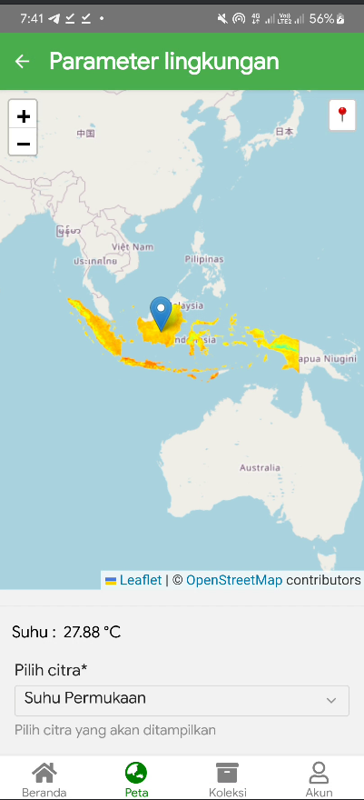

## Flora Sense
Mobile App Arboretum Biodiversity Mapping and Visualization System adalah solusi inovatif untuk memetakan dan memvisualisasikan keanekaragaman hayati secara digital. Aplikasi ini memanfaatkan teknologi GIS untuk memetakan lokasi spesies tanaman secara otomatis, dilengkapi dengan informasi seperti nama ilmiah tanaman, koordinat lokasi, probabilitas pertumbuhan, geotagging, ekstraksi koordinat dari foto tanaman, otomatisasi pembuatan peta berbasis web, serta pengelolaan database spesies tanaman. Dengan fitur real-time, pengguna dapat mengakses, menganalisis, dan membagikan data secara efisien. Selain itu, aplikasi ini memanfaatkan teknologi kecerdasan buatan (AI) yang memungkinkan identifikasi spesies tanaman dengan cepat dan akurat hanya dengan pengambilan foto.

## Identifikasi Lingkungan

## Framework dan Stack
DB: 

Front-End: 

Server: 

Map:  

API:  

## Sumber Data
1. Google Earth Engine Collection
2. PlantNet
3. Naturalist

## Roadmap
- [x] Authentication & Authorization
- [x] JWT
- [x] Earth Engine Analysis
- [x] Plant Identification
- [ ] Arboretum Collection
- [ ] Species Distribustion
- [ ] Geotag Mapping
- [ ] Dashboard
- [ ] ML

